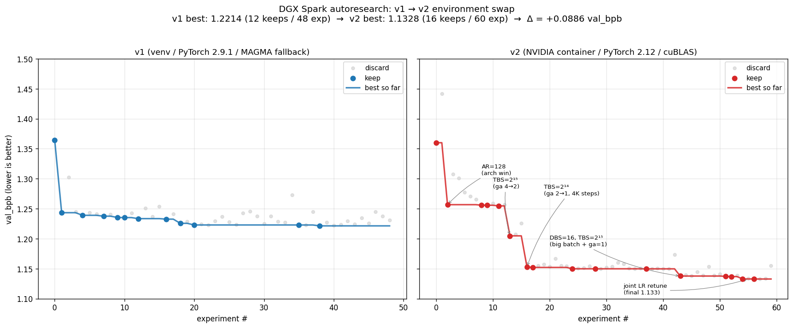

# Autoresearch on DGX Spark — Findings

Notes from ~110 autonomous training experiments on a single NVIDIA DGX Spark (GB10/Blackwell, ARM64), split across two environments. **TL;DR:** the off-the-shelf PyTorch wheel runs ~3× slower than the NVIDIA container because cuBLAS doesn't have native kernels for sm_121a (DGX Spark's Blackwell variant) and falls back to MAGMA. Fixing the environment changed both throughput *and* which model configurations are optimal.



---

## The platform

| | DGX Spark (GB10) | H100 (reference) |
|---|---|---|
| Architecture | sm_121a (Blackwell, ARM variant) | sm_90 (Hopper) |
| Compute (BF16) | 209 TFLOPS peak | 989 TFLOPS peak |
| Memory | 128 GB unified LPDDR5X (~270 GB/s) | 80 GB HBM3 (~3 TB/s) |
| Host arch | ARM64 (sbsa) | x86_64 |
| Practical MFU on this code | **~14-16%** (container) | ~35-50% (upstream) |

Three things make DGX Spark different from what most autoresearch forks assume:

1. **sm_121a, not sm_120.** The chip ID is `(12, 1)`, not `(12, 0)`. PyTorch's CUDA wheels (12.8) only know up to sm_120 (consumer Blackwell) and warn at startup. cuBLAS heuristics that ship with that wheel don't have BF16 GEMM entries for sm_121a; they silently dispatch to MAGMA instead. CUPTI 12 also fails to attach (`CUPTI_ERROR_INVALID_DEVICE`), so `torch.profiler` reports no kernel timings.

2. **ARM64 wheels are sparse.** FlashAttention 3, Triton 3.6, transformer_engine — none have aarch64 PyPI wheels at time of writing. `flash-attn` 2.x is buildable but slow on this arch. `kernels-community/flash-attn3` ships .so files but they aren't torch.compile-compatible (FakeTensor errors during dynamo tracing).

3. **Unified LPDDR5X memory.** Memory bandwidth is the binding constraint, not VRAM size. We never used more than 7 GB of the 121 GB available, but even at low memory consumption MFU caps out around 16% because weight loads dominate. This is structural, not a software fix.

---

## The environment trap

### What broke (v1: stock venv + PyTorch 2.9.1+cu128)

Symptoms: MFU stuck at **~4.92%**, `torch.profiler` returned only CPU dispatch times (no CUDA events). 60 min of optimization driven by `train.py` improvements got the model from val_bpb 1.364508 → 1.221383.

When we eventually traced under `nsys` (which has its own injection and doesn't rely on PyTorch's CUPTI), the smoking gun appeared:

```
40.9%  magma_sgemmEx_kernel<float, bf16, bf16, ...>   ← old MAGMA fallback
20.9%  magma_sgemmEx_kernel<...>
19.7%  magma_sgemmEx_kernel<...>
       (81.5% of GPU time spent in MAGMA, not cuBLAS)
```

`torch.backends.cuda.preferred_blas_library()` reported `_BlasBackend.Cublas`, but cuBLAS's heuristic for our matrix shapes on sm_121a was empty, so it returned MAGMA as fallback. MAGMA's hand-written `sgemmEx` doesn't use Blackwell's tensor-core MMA instructions; the chip's BF16 matrix engines were largely idle.

### What fixed it (v2: NVIDIA container `nvcr.io/nvidia/vllm:26.04-py3`)

NVIDIA ships a Blackwell-aware PyTorch in their April 2026 container. The relevant versions:

| Component | venv (v1) | Container (v2) |
|---|---|---|
| PyTorch | 2.9.1+cu128 | **2.12.0a0+0291f960b6.nv26.4** |
| CUDA runtime | 12.8 | **13.2** |
| Triton | 3.5.1 | 3.6.0+git5d72932fc5.nv26.3 |
| cuDNN | 9.10 | 9.21 |
| FlashAttention | bundled FA2 only | bundled FA2 + standalone 2.7.4 |
| Compiled arch list | up to sm_90 | includes `sm_120`, `compute_120` (JITs for sm_121a) |

After the swap, the same `profile_train.py` showed:

```
 7.64%  nvjet_sm121_tst_mma_128x208x64...    ← native Blackwell BF16 MMA
 5.01%  nvjet_sm121_tst_mma_128x96x64...
 4.09%  nvjet_sm121_tst_mma_128x160x64...
 3.93%  cutlass_80_tensorop_bf16_s16816gemm  ← Ampere CUTLASS fallback (~10% of GEMMs)
```

The `nvjet_sm121_*` prefix is NVIDIA's hand-tuned Blackwell-native kernels. MAGMA is gone. MFU jumped **4.92% → 13.75%** on the identical model. Step time dropped 270.9 ms → 96.8 ms.

The ~10% of GEMMs still falling back to CUTLASS sm_80 (Ampere) kernels is the next software lever — a future container update should close that gap.

### Setup (the working recipe)

```bash
# Container is pre-pulled on DGX Spark images; otherwise:
docker pull nvcr.io/nvidia/vllm:26.04-py3

docker run -d --name autoresearch-dgx \
    --gpus all --ipc=host \
    --ulimit memlock=-1 --ulimit stack=67108864 --shm-size=16g \
    -v /path/to/repo:/workspace \
    -v ~/.cache:/root/.cache \
    -w /workspace \
    nvcr.io/nvidia/vllm:26.04-py3 \
    tail -f /dev/null

# Install pyproject deps the container is missing
docker exec autoresearch-dgx pip install pandas pyarrow matplotlib rustbpe kernels

# Run training
docker exec autoresearch-dgx python3 train.py
```

---

## The search landscape

Both runs started from the same baseline (`fde11cc`: DEPTH=4, AR=64, DBS=8, ga=4, TBS=2¹⁶) and used single-axis hyperparameter search with keep-if-better, revert-otherwise. They diverged dramatically.

### v1 trajectory (venv, 48 experiments, 12 keeps)

```
1.364508  baseline
1.243339  DEVICE_BATCH_SIZE 8 → 32  (ga 4→1)     ← biggest win
1.238974  MATRIX_LR 0.04 → 0.06
1.237532  WEIGHT_DECAY 0.2 → 0.1
1.235397  UNEMBEDDING_LR 0.004 → 0.006
1.233459  ASPECT_RATIO 64 → 96  (model_dim 384, 20M params)
1.232577  DBS 32 → 16, TBS 2¹⁶ → 2¹⁵  (more opt steps)
1.225607  MATRIX_LR 0.06 → 0.05
1.222886  WEIGHT_DECAY 0.1 → 0.05
1.221383  MATRIX_LR 0.05 → 0.045  (final)
```

Optimum: **AR=96, DBS=16, TBS=2¹⁵, 20M params, ~1090 opt steps in 300s.**

### v2 trajectory (container, 60 experiments, 16 keeps)

```
1.359996  baseline (numerics drift: only −0.0045 from v1 baseline, within noise)
1.256720  ASPECT_RATIO 64 → 128  (model_dim 512, 29M params)  ← much wider possible
1.204727  TOTAL_BATCH_SIZE 2¹⁶ → 2¹⁵  (ga 4→2, 2197 steps)
1.152971  TBS 2¹⁵ → 2¹⁴  (ga 2→1, 4116 steps)                ← step-count win
1.149847  WARMUP_RATIO 0 → 0.05
1.137750  DBS 8 → 16, TBS 2¹⁴ → 2¹⁵  (reversed TBS direction at bigger DBS) ← shape change
1.132926  MATRIX_LR 0.03 → 0.04, UNEMBEDDING_LR 0.005 → 0.008  (joint retune)
1.132811  UNEMBEDDING_LR 0.007 → 0.008  (final)
```

Optimum: **AR=128, DBS=16, TBS=2¹⁵, 29M params, ~2310 opt steps in 300s.**

### Why the optima differ

It's the same hardware. What changed?

1. **Step count.** v2's faster kernels yield 2-4× more optimizer steps in the same 300 s. Configurations that lost on step starvation in v1 (DEPTH=8, AR≥128) become competitive in v2. Specifically: AR=128 lost in v1 (1.251 with only 410 steps) and won in v2 (1.257 with 1140 steps — and that was just the first v2 architectural change; further tuning at this width drove it to 1.133).

2. **Optimal batch shape moved.** v1 wanted `DBS=8, ga=4` for kernel-launch amortization (each call into MAGMA was expensive). v2 wanted `DBS=16, ga=1` for raw arithmetic intensity (cuBLAS prefers big single calls; launch overhead is cheap). The total tokens-per-step (TBS=2¹⁵) ended up the same — but for opposite reasons.

3. **LR/WD optima are largely preserved.** `WEIGHT_DECAY=0.05`, `WARMDOWN_RATIO=0.7`, Muon `ns_steps=5`, MLP expansion 4×, ResFormer value embeddings, softcap=15 — all transferred from v1 to v2 unchanged or barely changed. **Hyperparameter wins generalize across the env boundary; architectural and batch-shape wins do not.**

### Non-monotonic search note

v2's TBS journey is interesting: it went 2¹⁶ → 2¹⁵ → 2¹⁴ → back to 2¹⁵ (with DBS doubled). The first two TBS reductions traded gradient quality for step count, hit a sweet spot at 2¹⁴, then a *different* configuration (bigger DBS, same TBS, no grad-accum) unlocked another 0.015 bpb at TBS=2¹⁵. Single-axis search found this by accident — a smarter agent might have found it sooner by searching `(DBS, TBS)` jointly.

---

## The final recipe (v2)

```python
# Model
ASPECT_RATIO = 128         # model_dim = depth * 128 = 512
HEAD_DIM = 128
WINDOW_PATTERN = "SSSL"    # irrelevant on SDPA backend
DEPTH = 4                  # 29.4M params total

# Optimization
DEVICE_BATCH_SIZE = 16
TOTAL_BATCH_SIZE = 2**15   # ga=1, 32K tokens/opt step
EMBEDDING_LR = 0.8         # Adam, for wte
UNEMBEDDING_LR = 0.008     # Adam, for lm_head
MATRIX_LR = 0.04           # Muon, for transformer matrices
SCALAR_LR = 0.5            # Adam, for resid_lambdas / x0_lambdas
WEIGHT_DECAY = 0.05        # cautious WD for Muon
ADAM_BETAS = (0.8, 0.95)
WARMUP_RATIO = 0.05
WARMDOWN_RATIO = 0.75
FINAL_LR_FRAC = 0.0

# Achieves: val_bpb = 1.1328, MFU = 15.85%, 2306 opt steps in 300s
```

**Architecture decisions that transfer from upstream nanochat unchanged:** Muon + AdamW combined optimizer, ResFormer value embeddings (alternating layers), ReLU² activation, RMSNorm, rotary embeddings, dense skip residuals (`x0_lambdas`), softcap=15, MLP expansion 4×.

**Decisions that are DGX-Spark-specific:** SDPA replacing FA3 (no ARM64 FA3 wheel), `TRITON_PTXAS_PATH=/usr/local/cuda/bin/ptxas` (triton's bundled ptxas predates sm_121a), GB10_BF16_PEAK_FLOPS=209e12 (replacing H100's 989.5e12).

---

## What we tested and discarded

Searches that *didn't* help (all in v2 unless noted):

| Change | Best achieved | vs current best | Why |
|---|---|---|---|
| DEPTH 4 → 5, 6, 8 | 1.166-1.277 | worse | trades opt steps for capacity at unfavorable ratio |
| DEPTH 4 → 3 | 1.160 | worse | loses too much capacity even with 7K steps |
| ASPECT_RATIO 128 → 160, 192 | 1.144-1.155 | worse | bigger model not enough compute to train |
| HEAD_DIM 128 → 64 | 1.158 | worse | smaller heads less efficient on Blackwell tensor cores |
| MLP expansion 4× → 3× | 1.154 | worse | capacity loss > step gain |
| Disable value embeddings | n/a in v2 (tested in v1 = 1.246) | worse | ResFormer trick is load-bearing |
| Muon `ns_steps` 5 → 3 | 1.154 | worse | orthogonalization quality matters |
| WEIGHT_DECAY 0.05 → 0.0 | 1.155 | worse | some regularization is load-bearing |
| ADAM_BETAS β1 0.8 → 0.9 | 1.152 | worse | lower β1 better for noisy gradients here |
| MQA (n_kv_head=1) | n/a in v2 (tested in v1 = 1.237) | worse | full multi-head attention worth it at this size |

---

## Performance characteristics (v2)

Profiled `profile_train.py` over 10 steps of training under `nsys`, post-compile:

| Phase | Self GPU time | Notes |
|---|---|---|
| GEMMs (`nvjet_sm121_*`, native Blackwell) | ~20% | core matmul, four shape variants |
| GEMMs (`cutlass_80_*`, Ampere fallback) | ~10% | shapes cuBLAS doesn't have native Blackwell for yet |
| Flash attention (fwd + bwd) | ~13% | bundled `pytorch_flash::flash_*_kernel` |
| Triton fused norm/relu²/embed | ~10% | RMSNorm, MLP activation, value embedding lookup |
| Cross-entropy + softmax | ~4% | loss kernels |
| Muon + Adam (`adamw_step_fused`, `muon_step_fused`) | ~1% | already torch.compile'd |
| H2D memory copies | <0.1% | `pin_memory=True` + `non_blocking=True` paying off |
| GPU idle gaps | ~0% | the chip is fully fed |

CUDA API breakdown: 1730 `cuLaunchKernel` calls per 10 steps (~173/step). Launch overhead is small (4.2 µs avg) so kernel fusion isn't an obvious lever.

---

## The bandwidth ceiling

Here's the structural limit nobody's software is going to fix:

```
GB10 BF16 peak compute: 209 TFLOPS
GB10 memory bandwidth:  ~270 GB/s (LPDDR5X)
Compute/bandwidth ratio: 774 FLOPS per byte loaded
```

vs. H100:

```
H100 BF16 peak compute: 989 TFLOPS
H100 memory bandwidth:  ~3 TB/s (HBM3)
Compute/bandwidth ratio: 330 FLOPS per byte loaded
```

A GEMM of size (M, K) × (K, N) does 2·M·N·K FLOPS while loading M·K + K·N + M·N bytes. For our typical attention shape (B·T=32K, K=512, N=512) the arithmetic intensity is ~512 FLOPS/byte — H100 is compute-bound, but GB10 needs 774/byte to be compute-bound, so it's **memory-bound** at our sizes. This is why MFU caps around 16% no matter what we do.

To push past that, the model would need to be much larger (better arithmetic intensity per byte loaded) — but bigger models lose on opt-step count within the 5-min budget. We're stuck at the trade-off equilibrium.

The only routes past 16% MFU:
- **fp8**: Blackwell tensor cores hit 420 TFLOPS in fp8 (2× BF16 peak), which roughly doubles the achievable MFU ceiling if numerics hold. Requires `torchao` or `transformer_engine` integration.
- **Sparser attention or recompute tricks**: lower bytes-loaded per FLOP done. Big code lift.
- **A future cuBLAS update that puts the 10% CUTLASS-fallback shapes onto native Blackwell kernels**: a free ~3-5% MFU bump on the day it lands.

---

## What's left on the table

Open levers, ranked by expected impact:

1. **Multi-seed validation.** Several of the v2 "tiny wins" (Δ < 0.001) are within single-seed noise. Re-running the last ~10 keeps with 3 seeds each would tell us which decisions are real. Cheap but takes 30 more minutes of compute.

2. **fp8 path.** Try `torchao.float8` linear layers on the matmul-heavy layers. Most likely path to MFU > 20%. Risk: numerics drift bigger than the throughput gain.

3. **cuDNN attention backend.** `with torch.nn.attention.sdpa_kernel(SDPBackend.CUDNN_ATTENTION)` — might beat the bundled FA2 on Blackwell. Untested.

4. **Joint (DBS, TBS, MATRIX_LR) search.** Our v2 trajectory found the new sweet spot by accident. A 3×3×3 grid would land it in 27 runs instead of stumbling through 60.

5. **FA3 from source (Hopper branch).** `flash-attn` has a `hopper/` subtree that compiles for Blackwell. Build is non-trivial on ARM64 but doable. Estimated upside: attention is currently ~13% of GPU time; a 2× speedup there is ~6% step time, ~0.005 bpb.

6. **Larger model + bigger DBS hoping for compute-bound regime.** At AR=256 we'd cross into compute-bound territory (better arithmetic intensity per byte) — but we'd also lose 4× the opt steps. Probably still net negative within 300s; might win at 600s budget.

---

## Reproducibility

- Branch: `autoresearch/may26`
- v2 best commit: `bd00292`
- v2 baseline commit: `fde11cc`
- All experiment commits are in the branch git history, one per experiment, with `expN: <description>` message format.
- Container image SHA: see `docker image inspect nvcr.io/nvidia/vllm:26.04-py3`
- Raw experiment log: `results.tsv` (v2), `results_v1.tsv` (v1, preserved)
- Profile traces: `profile_report.nsys-rep` (v1 environment), see `profile_train.py` for the harness
- This document was generated after experiment 60, before further tuning.

The `5-minute val_bpb on this GPU` metric is platform-specific by design (per Karpathy's upstream README). These numbers are not directly comparable to runs on other hardware.
